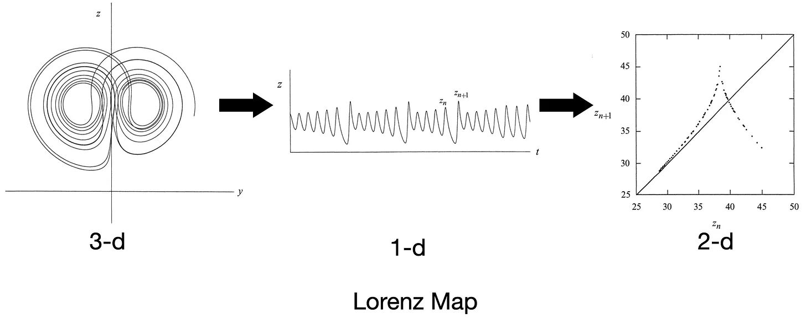
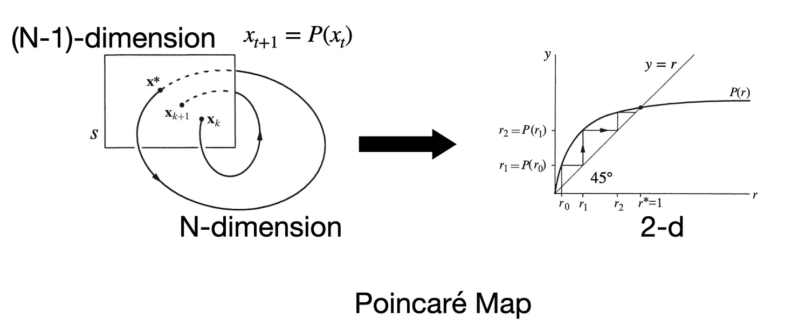

# 最聪明的脑子也是马尔可夫的

最近读了 Steven Strogatz 写的教材 **《NONLINEAR DYNAMICS AND CHAOS》**。看到 **8.7 节 Poincaré Map** 和 **9.4 节 Lorenz Map**，深深体悟到最聪明的脑⼦也是在⽤⻢尔可夫系统在思考低维的时序变化。

**Lorenz Map** 是洛伦兹为了找出混沌中的规律，他提取了每次 `z(t)` 的局部最⼤值 `z_n`，并作出 `z_n+1` 对 `z_n` 的图像——⼏乎形成⼀条单值曲线（Lorenz map）。

  

> *It therefore seems that some single feature of a given circuit should predict the same feature of the following circuit.*  
> ——Lorenz, E. N. (1963). *Deterministic Nonperiodic Flow*. *Journal of the Atmospheric Sciences*, 20(2), 130–141.

需要注意的是，在 60 年代的⽓象学和流体⼒学研究中，主流确实是依赖⼤机房做⾼维数值求解（simulation），尤其是做天⽓预报的⼈，倾向于：

1. 把⽅程在空间上离散化；
2. ⽤尽量多的变量和分辨率来接近真实⼤⽓；
3. 然后⽤计算输出直接分析天⽓形态。

这种⽅法在捕捉全局统计特性和直接预测⽅⾯很有效，但不容易看清系统为何会有某种不稳定或模式。

洛伦兹的策略⼏乎是逆向的：他不是要模拟真实天⽓，⽽是⽤极有限的⾃由度去挖掘导致不可预测性的最⼩机制。

与此相类似的是法国数学家 **Henri Poincaré** 在 19 世纪末提出的 **Poincaré Map**。在⾼维连续流⾥，直接分析轨迹很复杂，如果我们在相空间⾥选取⼀个适当的截⾯（surface of section），只记录轨迹每次穿过截⾯的点，就能得到⼀个低维的离散映射来描述动⼒学。

  

毫⽆疑问，以上两种⽅法的创作者都是最聪明⼈类的代表，但即使如此，他在表达⼀个知识的理解的时候，还是在⽤⻢尔可夫的近似，去寻找低维的特征，去解释复杂系统的最重要性质。

---

在强化学习（RL）中，我们通常把环境建模成 **⻢尔可夫决策过程（MDP）**，即假设当前状态 `St` 已经包含了对未来演化所需的全部信息。如果状态定义恰当，这个假设成⽴，那么直接在当前状态基础上做策略搜索（policy search）就能找到最优或较优策略，不需要显式记忆⻓历史。对很多短期、低延迟反馈的任务（⽐如简单 Atari 游戏），标准 **MDP + Q-learning** 确实⾜够应付。

当然，为了实现更远的计划，我们也会使⽤ **Successor Representation (SR)**，本质上在⻢尔可夫框架下，预先编码了“从当前状态开始，未来各状态出现的折扣期望频率”。从⻢尔可夫性质的⻆度看，SR 仍假设当前状态满⾜⻢尔可夫性，但它显式表示了基于某策略 `π` 下状态之间的⻓期依赖结构，使得规划或奖励变化时能快速调整⾏为。

---

外界给所有⼈类的挑战，本质上都可以抽象成某种 **⻢尔可夫决策过程（或近似⻢尔可夫）**（问题的普遍性）。即便是最聪明的⼈，他们在解决问题时，本质机制也⼤多遵循⻢尔可夫性质（能⼒的上限）。

既然问题和能⼒都落在⻢尔可夫性质的框架内，那么理解我们的认知系统，也许抓住⻢尔可夫性质这个原则就是关键。
